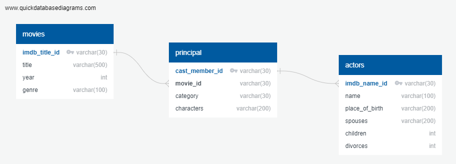

<h2>Courtney Gomez  |  Lisa Harrell  |  Carlos Quiroz  | Gerald Watts III </h1>

## INTRODUCTION

The goal of this project is to illustrate Extract Transform Load (ETL) using Excel, Python and SQL.  ETL is a process commonly done in computing, which takes raw data, cleans it and stores it for later use.  The extraction phase targets and retrieves the data.  Transform manipulates and cleans the data. Then load stores the data, typically in a data warehouse. After ETL is completed, the data can be used for analytics to help achieve business objectives.  

## MAIN OBJECTIVES
<ul>
    <li>Collect data  from various maintained sources </li>
    <li>Perform cleaning, merging, filtering, normalization and aggregations of all the data being used</li>
    <li>Upload the files in a database in preparation for more thorough analysis</li>
    <li>Formulate ideas on what types of questions or analyses can be drawn from the datasets</li>
</ul>

## DATA SOURCES AND DESCRIPTIONS
<ul>
<li>We obtained 3 data files from https://www.kaggle.com </li>
    <ul>
    <li>IMDb movies.csv</li>
    <li>IMDb names.csv</li>
    <li>IMDb title_principles.csv</li>
</ul>

## DATA EXTRACTION
For the data extraction phase, we extracted data from 3 csv files.  In Jupyter Notebook, the data was imported by using the csv module which can read csv data.  The file paths were saved and the module can import data by connecting through the file path locations.  We developed the design of our database using quickdatabasediagrams.com.  On this website, you can name tables and columns and assign data types for your database.  Each table has a primary key and we linked the tables together using primary and foreign keys.  After the schema was designed, we exported the file and uploaded it into PGAdmin to create the structure of the database.
</ul>

</ol>

## DATA TRANSFORMATION (Python & Pandas) - 
During the transformation phase, we performed various data cleaning tactics to get the data clean before loading into the database.  
<ol>
    <li><strong>Data Cleaning & Filtering</strong></li>
        <ul>
            <li>Dataset1: movie.csv </li>
                <ul>
                    <li>????????</li>
                    <li>????????</li>
                    <li>????????</li>
                </ul>
            <li>Dataset2: names.csv </li>
                <ul>
                    <li>Removed all columns except "imdb_name_id, name, spouses, children, divorces"</li>
                    <li>Checked and dropped all null values</li>
                    <li>Checked and dropped duplicate values in the 'imdb_name_id' column</li>
                </ul>
            <li>Dataset3: principal.csv </li>
                <ul>
                    <li>????????</li>
                    <li>????????</li>
                    <li>????????</li>
                </ul>
 <li><strong>Data Normalization</strong>

</li>
        <ul>
            <li>Final normalized datasets</li>
            <ul>
                <li>movie data - normalizing not needed because data is small</li>
                <li>actors data - normalizing not needed because data is small</li>
                <li>principal data - normalizing not needed because data is small</li>
        </ul>
</ol>

## DATA LOADING (PGAdmin SQL)
</ol>
    <li>Created ERD Diagram via QuickDBD that shows how all the different normalized has been related</li>
        <ul>
            <li>Used movie_id and cast_member_id as primary & foreign keys</li>
        </ul>
    
    
    <li>Created a new database called ERD_db</li>
    <li>Wrote a Schema to create the tables in the database and setting primary keys for each dataset</li>
    <li>Imported all three normalized datasets successfully in SQL server </li>
    <li>Generated some queries to show how the data can be useful to analysts in the future</li>

